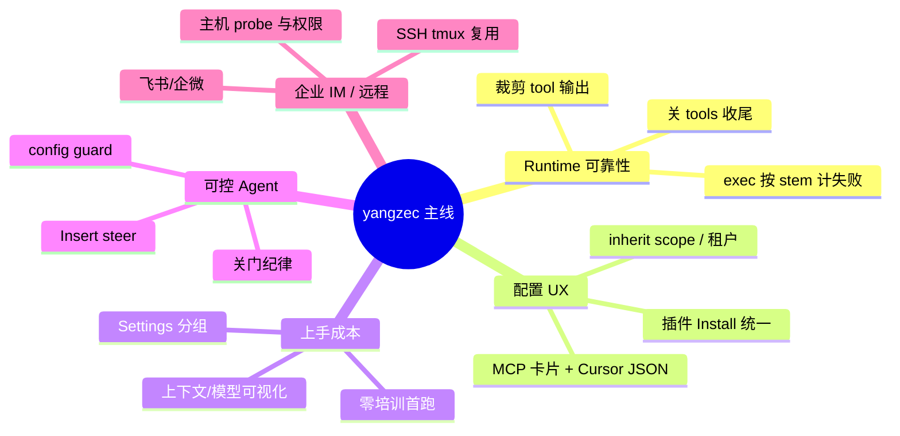

# yangzec 主要改动方向

基于仓库 `yangzec/fastclaw` 中 **yangzec** 约 41 条提交/合并记录的归纳（现象 → 解决思路）。

---

## 1. Agent 回合稳定性（工具死循环 / 超大输出 / 执行失败）

| 现象 | 解决思路 |
|------|----------|
| 工具输出巨大 → 网关 502、回合崩溃 | 在真实 SDK 执行路径上 **裁剪 tool dump**；失败摘要 nil-safe；超限重试按「被拒绝的尺寸」算，而不是硬怼 1M 窗口（[#29](https://github.com/yangzec/fastclaw/pull/29)） |
| 单轮在工具上 **空转**（同参重复调、XML 工具标记泄漏、空回复） | **裁剪输出**；wrap-up 阶段 **拒绝已禁用的工具**；从 **第一次 Chat** 走 `HandleMessageStream`，避免第二次还带 tools 的请求；同参循环 → **关 tools 收尾**；空回复 **一次 tools-off 重试**；在 provider/agent 层 **scrub 泄漏的 XML**，且不执行（`9852a35`） |
| `python3` 失败后连 `pip3` 也被 ban；或 doctor 包装命令误判 | 按 **命令 stem** 计失败 streak，而不是整类 exec 一刀切；wrap-up 禁止 **假 sandbox 叙述**（`9af422a`） |

---

## 2. 上下文与会话（Compaction / 计量 / 模型默认）

| 现象 | 解决思路 |
|------|----------|
| 长对话撑爆上下文 | **Pi 式 session compaction**（`9c2a603`），并有多轮 compaction 修复（PR #12 等） |
| 各模型 context / max-output 配置混乱 | 为 GPT、智谱、Kimi、Grok 等加 **官方推荐默认值**（`9676641`）；Composer **上下文条 + 模型切换器 + 按模型 limits**（[#39](https://github.com/yangzec/fastclaw/pull/39)） |

---

## 3. 「零培训」首跑与 Dashboard 信息架构

| 现象 | 解决思路 |
|------|----------|
| 新用户不知道先配什么、进不了对话 | **单屏 onboard**：粘贴 key → 直接进 **最老 agent 的 chat**；Overview 与真实状态一致；新建/已有 agent **继承可用模型**（[#50](https://github.com/yangzec/fastclaw/pull/50)） |
| 设置项散、难找 | Settings 收成 **Talk / Teach / Connect / Run**；空 chat 有 **Adjust this agent**；Skills 有 **featured 安装**；`/cron`、`/channels` 指向当前 agent |
| 插件安装只有概念、CLI/控制台不一致 | **Install/Upload 真实 UX**，CLI 与 Dashboard 共用（[#57](https://github.com/yangzec/fastclaw/pull/57)） |

---

## 4. MCP / 插件 / Skills 配置与多租户

| 现象 | 解决思路 |
|------|----------|
| MCP 只能啃 JSON、保存后看不到工具有没有挂上 | 列表 **卡片化**；JSON 留在 **Add 对话框**；支持 **Cursor 风格 mcp.json**；工具标 `source=mcp`，保存后卡片能列出 **已附着工具**（[#36](https://github.com/yangzec/fastclaw/pull/36)、`3d8eb08`） |
| 管理员共享 vs 用户私有边界不清 | **可配置 inherit scope + 租户隔离**（MCP、plugins、skills）（`6d27b80`） |
| Admin Chats / MCP Add / Save 反馈差 | 专门 PR：**Open、Add、Save 反馈 UX**（[#55](https://github.com/yangzec/fastclaw/pull/55)） |

---

## 5. 「关门」与 Agent 自改配置的纪律

| 现象 | 解决思路 |
|------|----------|
| 模型通过 `configure_agent` 等 **关掉 MCP/插件/Provider**（#31 类） | 不靠长说明：失败路径 **点出真实被关的门**；禁止 retry / `--help` / 读源码绕过去；工具描述 **只允许合法 key**；prompt **一条纪律覆盖整类关门**（[#54](https://github.com/yangzec/fastclaw/pull/54)） |
| 用户不知道本轮用了多少 token | 回合结束在输入框旁显示 **12.4k → 890**（与上下文条分离）（#42） |
| 想中途改方向要等整轮结束 | **Insert** 取消 in-flight 流、保留半截回复、**同一回合掉头**；修复 cancel 时 **丢最后 content_delta**（走 turn ctx）（#33 / #54） |

---

## 6. Chat / Markdown / 前端细节

| 现象 | 解决思路 |
|------|----------|
| 回复里露出 ` ``` ` 围栏 | Markdown 渲染修复（[#38](https://github.com/yangzec/fastclaw/pull/38)、PR #13） |
| 新开/切换 session 还要点输入框 | **自动 focus composer**（`2a95c61`） |
| Open files 角标与面板数量不一致 | 统一计数逻辑（[#49](https://github.com/yangzec/fastclaw/pull/49)） |
| Customize 多 Tab Save 串写、重叠 | 只写 **当前可见 tab**、修 overlap（[#43](https://github.com/yangzec/fastclaw/pull/43)） |
| 刷新后工具状态丢 | **Refresh 后工具仍可用**（PR #14） |

---

## 7. SSH / 远程执行

| 现象 | 解决思路 |
|------|----------|
| 每次 ssh 新建连接、输出丢 | **连接复用 + keepalive**；**2h idle**；远程 **tmux** 会话 `fastclaw-<alias>`；stdout/stderr **串行化**（[#46](https://github.com/yangzec/fastclaw/pull/46)） |
| 配错 SSH 主机才发现 | **添加时 probe**（`echo ok`），失败 **400 且不写库**；列表展示 **Connected / Failed / Not tested**（[#53](https://github.com/yangzec/fastclaw/pull/53)） |
| 主机权限模型 | **SuperAdmin / host access** 相关 PR（#35） |
| Agent 改配置风险 | **Agent config guard**（#37） |

---

## 8. IM / 企业协作通道

| 现象 | 解决思路 |
|------|----------|
| 飞书待办/文档列表空、不能改 | 官方 **list/get/update**；变更 **先 preview + confirm_token**；待办用 **bot 创建的 task v1** 过滤当前发送者（租户 token 无法 my_tasks）（[#51](https://github.com/yangzec/fastclaw/pull/51)） |
| 企微日历/文档等能力未接 | **Intelligent Robot CLI** 接 calendar、docs，并补齐剩余 CLI 能力（`b476f13`、`a9e5cfa`） |
| 群 @、IM 发文件 | 分支 **wecom-group-mention**、**im-r2-file-send**（PR #23 / #22） |
| 多副本企微长连接 | 开放中的 **WeCom channel**（[#108](https://github.com/yangzec/fastclaw/pull/108)）：Bot 长连、流式 Markdown、Redis 出站有序、租约与身份隔离 |

---

## 9. 存储、部署与工程

| 现象 | 解决思路 |
|------|----------|
| Session 存储方案 | **R2 session storage** 规划/实现（PR #15） |
| 局域网默认可访问性 | **LAN bind default**（PR #26） |
| Codex 式 follow-up 队列 | **codex-followup-queue**（PR #25） |
| Dashboard CI 因时区 / flaky 挂 | **时区无关测试** + 恢复 build（`b4f1d21`） |
| pnpm 11 frozen install 卡 build | 修安装/冻结策略（`fe16860`） |

---

## 10. 知识库与计费

| 现象 | 解决思路 |
|------|----------|
| 知识库只能单文件、中文名乱码 | **多文件上传 + 保留中文文件名**（[#41](https://github.com/yangzec/fastclaw/pull/41)） |
| 官网模板 agent 用量归属 | **Owner billing** 套用（[#52](https://github.com/yangzec/fastclaw/pull/52)） |

---

## 总览：反复推进的几条线



1. **Runtime 可靠性**：工具输出、死循环、exec 误判——在 SDK 真实路径上裁剪、关 tools、按 stem 计失败。
2. **可运维的配置 UX**：MCP/插件/Skills 卡片 + Cursor JSON + 保存即见工具；租户 inherit scope。
3. **降低上手成本**：零培训首跑、Settings 分组、上下文/模型可视化。
4. **可控的 Agent**：关门纪律、Insert steer、configure guard。
5. **企业 IM 与远程**：飞书/企微工具链、SSH/tmux、主机探测与权限。

---

## 参考：代表性 commit

| Hash | 说明 |
|------|------|
| `cd4d0ac` |  giant tool dumps → 502 / crash |
| `9852a35` | 单轮工具空转 |
| `9af422a` | exec fail streak by command stem |
| `9c2a603` | Pi-style session compaction |
| `6d27b80` | inherit scope + tenant isolation |
| `ac7e9f5` | Zero-training first run |
| `d26af92` | plugins Install/Upload UX |
| `039caf9` | 关门 / token / Insert |

---

*文档由 git 历史归纳，PR 链接指向 `yangzec/fastclaw` fork；与 upstream 编号可能一致。*
