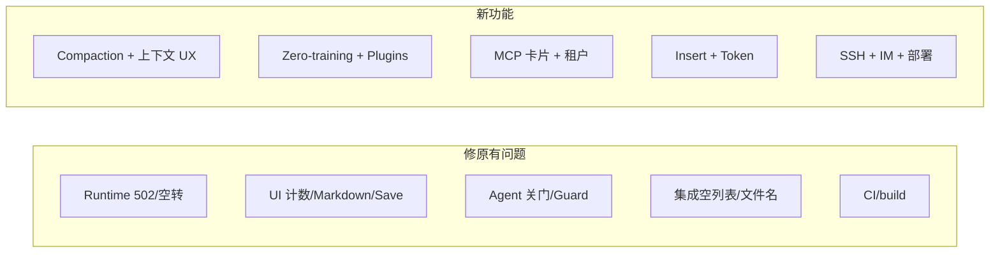

# yangzec 主要改动方向

基于仓库 `yangzec/fastclaw` 中 **yangzec** 约 41 条提交/合并记录的归纳。

**分类说明**

| 标签 | 含义 |
|------|------|
| **修** | 修已有 bug、回归、或「产品本来承诺/应有」但坏了的体验 |
| **新** | 此前没有的能力、通道、或明显的新产品面 |
| **修+新** | 同一 PR/主题里既有修也有新能力（拆开写） |

---

## 一、修原有问题

> 仅「修」的详细条目（现象 + 解决思路）见 [`yangzec-fixes.md`](./yangzec-fixes.md)。

### Agent / 网关运行时

| 现象（原问题） | 解决思路 | 参考 |
|----------------|----------|------|
| 工具输出过大 → 回合 502、网关崩溃 | SDK 路径裁剪 dump、nil-safe 失败摘要、按被拒尺寸重试 | [#29](https://github.com/yangzec/fastclaw/pull/29) `cd4d0ac` |
| 单轮在工具上死循环（同参重复、XML 泄漏被当工具执行、空回复） | 裁剪输出；wrap-up 禁工具；首包走 stream；同参关 tools 收尾；provider/agent  scrub XML | `9852a35` |
| `python3` 失败导致后续 `pip3` 等一律被 ban；doctor 包装误判 | 按 **命令 stem** 计失败 streak；wrap-up 禁假 sandbox 叙述 | `9af422a` |
| Compaction 行为不正确 / 需对齐 Pi 预期 | Compaction 修复与 follow-up（在 compaction 功能之上的修） | PR #12 `99686a7` |

### Chat / Dashboard 展示与交互

| 现象（原问题） | 解决思路 | 参考 |
|----------------|----------|------|
| 助手回复里露出裸 ` ``` ` 围栏 | Markdown 渲染修复 | [#38](https://github.com/yangzec/fastclaw/pull/38)、PR #13 |
| Open files 角标与文件面板数量不一致 | 统一计数来源 | [#49](https://github.com/yangzec/fastclaw/pull/49) |
| Customize 多 Tab：Save 串写、面板重叠 | 只持久化当前可见 tab；修 overlap | [#43](https://github.com/yangzec/fastclaw/pull/43) |
| 刷新页面后工具/MCP 状态像「丢了」 | Refresh 后保持工具注册/可用 | PR #14 |
| Admin Chats Open、MCP Add、Save 无反馈或难用 | 补全操作反馈与流程 UX | [#55](https://github.com/yangzec/fastclaw/pull/55) |
| MCP 保存后卡片上看不到新挂上的工具 | 工具注册标 `source=mcp`，卡片读 live registry | [#36](https://github.com/yangzec/fastclaw/pull/36)（修的部分） |

### Agent 行为 / 配置被模型「搞坏」

| 现象（原问题） | 解决思路 | 参考 |
|----------------|----------|------|
| 模型用 `configure_agent` 等关掉 MCP/插件/Provider（#31） | 拒绝时指出真实被关的门；禁 retry/`--help`/读源码；工具 schema 白名单 key；prompt 纪律 | [#54](https://github.com/yangzec/fastclaw/pull/54)（**关门**部分） |
| Agent 可改危险/错误配置 | Config guard 限制可改范围 | PR #37 |
| Insert 打断流时丢最后几段 `content_delta` | cancel 的 delta 改走 turn ctx，半截回复保留 | [#54](https://github.com/yangzec/fastclaw/pull/54)（**Insert 修**部分） |

### 集成 / 数据（本应能用却为空或错）

| 现象（原问题） | 解决思路 | 参考 |
|----------------|----------|------|
| 飞书待办列表一直空（租户 token 调不了 my_tasks） | 用 task v1 列 bot 创建任务并按发送者过滤 | [#51](https://github.com/yangzec/fastclaw/pull/51)（**列表**部分） |
| 知识库多文件、中文文件名支持差/乱码 | 多文件上传并保留中文名 | [#41](https://github.com/yangzec/fastclaw/pull/41) |

### 工程 / CI

| 现象（原问题） | 解决思路 | 参考 |
|----------------|----------|------|
| Dashboard build 挂、测试依赖本机时区 | 恢复 build；测试与时区解耦 | `b4f1d21` |
| pnpm 11 frozen install 导致 `make build` 失败 | 调整 frozen/安装策略 | `fe16860` |

---

## 二、新功能

### 会话 / 模型 / 上下文（新能力）

| 能力 | 说明 | 参考 |
|------|------|------|
| Pi 式 session compaction | 长对话压缩上下文（新机制） | `9c2a603` |
| 上下文条 + 模型切换器 + 按模型 limits | Composer 可视化与切换 | [#39](https://github.com/yangzec/fastclaw/pull/39) |
| 各模型官方 context / max-output 默认值 |  onboard/Models 一键套用推荐值 | `9676641` |
| 回合结束 **本轮 token**（如 12.4k → 890） | 与长期上下文条分开展示 | [#54](https://github.com/yangzec/fastclaw/pull/54)（**token**部分） |

### 上手与信息架构（新产品面）

| 能力 | 说明 | 参考 |
|------|------|------|
| Zero-training 首跑 | 单屏粘贴 key → 直接进最老 agent chat；Overview 如实；agent 继承可用模型 | [#50](https://github.com/yangzec/fastclaw/pull/50) |
| Settings 分组 Talk / Teach / Connect / Run | 设置 IA 重组 | [#50](https://github.com/yangzec/fastclaw/pull/50) |
| 空 chat「Adjust this agent」、featured Skills、`/cron` `/channels` 深链 | 引导与快捷入口 | [#50](https://github.com/yangzec/fastclaw/pull/50) |
| 插件 Install / Upload（CLI 与 Dashboard 共用） | 真实安装/upload 流程 | [#57](https://github.com/yangzec/fastclaw/pull/57) `d26af92` |

### MCP / 多租户（新配置模型）

| 能力 | 说明 | 参考 |
|------|------|------|
| MCP 卡片 UI + Add 对话框粘贴 JSON | 替代「整页 JSON 编辑器」为主界面 | [#36](https://github.com/yangzec/fastclaw/pull/36) |
| 接受 **Cursor 风格** `mcp.json` | 兼容 Cursor 配置格式 | `3d8eb08` |
| **inherit scope** + 租户隔离（MCP、plugins、skills） | 管理员共享 vs 用户私有可配置 | `6d27b80` |

### 对话控制（新交互）

| 能力 | 说明 | 参考 |
|------|------|------|
| **Insert** 打断 in-flight 流、同一回合改方向 | 不等整轮结束（含移动端 Queue/Insert 露出） | [#54](https://github.com/yangzec/fastclaw/pull/54)（**Insert 能力**部分） |
| 新/切换 session 自动 focus 输入框 | 减少多点一步 | `2a95c61` |

### SSH / 主机（新运维能力）

| 能力 | 说明 | 参考 |
|------|------|------|
| SSH 连接复用 + keepalive + 2h idle + 远程 tmux `fastclaw-<alias>` | 长会话与输出完整（stdout/stderr 串行） | [#46](https://github.com/yangzec/fastclaw/pull/46) |
| 添加 SSH 主机时 **probe**（`echo ok`）+ 列表 Last test 状态 | 保存前校验，失败不入库 | [#53](https://github.com/yangzec/fastclaw/pull/53) |
| SSH 主机记录 / 地址簿 | 持久化主机配置 | PR #28 |
| SuperAdmin + **host access** 权限模型 | 平台级主机访问控制 | PR #35 |

### IM / 企业协作（新通道与工具）

| 能力 | 说明 | 参考 |
|------|------|------|
| 飞书待办/云文档 **读 + 确认后改**（confirm_token） | 新 official 工具面 | [#51](https://github.com/yangzec/fastclaw/pull/51)（**读写**部分） |
| 企微 Intelligent Robot：日历、文档及剩余 CLI 能力 | 新集成面 | `b476f13`、`a9e5cfa` |
| 企微群 @、IM经 R2 发文件 | 新消息/附件能力 | PR #22、#23 |
| **WeCom Channel**（长连 Bot、流式 Markdown、Redis 有序出站、租约） | 全新内置通道（Draft） | [#108](https://github.com/yangzec/fastclaw/pull/108) |

### 部署 / 平台 / 计费

| 能力 | 说明 | 参考 |
|------|------|------|
| Session **R2** 存储方案 | 云化 session 持久化 | PR #15 |
| 默认 **LAN bind** | 局域网访问默认策略 | PR #26 |
| **Codex 式 follow-up 队列** | 排队跟进消息 | PR #25 |
| 官网 template-agent **owner billing** | 用量归 owner | [#52](https://github.com/yangzec/fastclaw/pull/52) |

---

## 三、修 + 新（同一主题拆开看）

| 主题 | 修（原问题） | 新（新能力） | 参考 |
|------|--------------|--------------|------|
| [#54](https://github.com/yangzec/fastclaw/pull/54) | 模型关 MCP/插件/Provider；Insert cancel 丢 delta | 关门错误「门路标」；本轮 token；Insert  steer | #31、#33、#42 |
| [#51](https://github.com/yangzec/fastclaw/pull/51) | `feishu_list_tasks` 永远空 | list/get/update 待办；文档 append/retitle + 确认流 | — |
| [#36](https://github.com/yangzec/fastclaw/pull/36) | 保存后卡片不列 MCP 工具 | 卡片化 MCP 管理 + 对话框 JSON | — |
| SSH 栈 | （旧行为：易丢输出、无探测） | tmux 复用 + 添加时 probe + 主机簿 + 权限 | #46、#53、#28、#35 |
| Compaction | PR #12 修实现/边界 | `9c2a603` 引入 Pi 式 compaction | #12、`9c2a603` |

---

## 四、按 commit 类型速查

### 明确为 `fix` / Fix 的提交

`cd4d0ac` · `9852a35` · `9af422a` · `3c2a2f7` · `8555f70` · `f7612fe` · `f163100` · `b4f1d21` · `fe16860` · PR #12/#13/#14/#43/#49/#55（及 #36 中 registry 修复）

### 明确为 `feat` / 产品新面的提交

`9c2a603` · `9676641` · `9417cc9` · `ac7e9f5` · `d26af92` · `6d27b80` · `451efa2` · `d0d573f` · `b476f13` · `a9e5cfa` · `039caf9`（混合，见上表）· `3d8eb08` · `21395cb` · PR #15/#22/#23/#25/#26/#28/#35/#37/#39/#50/#51/#52/#53/#57/#108

### 体验增强（非典型 bug，算「新/ polish」）

`2a95c61`（focus composer）· MCP 从页级 JSON 改为卡片（`a5bc2b1` → `21395cb` 迭代）

---

## 五、总览（按性质）

| 性质 | 主线 |
|------|------|
| **修** | 工具输出/死循环/exec 误判；Markdown/Customize/Open files；刷新丢工具；MCP 卡片不显示工具；飞书空列表；知识库文件名；build/测试；Agent 乱改配置 |
| **新** | Compaction；上下文条与模型切换；零培训 onboard；插件安装；inherit/租户；Cursor MCP JSON；Insert/token；SSH tmux+probe+权限；飞书/企微工具与通道；R2/LAN/队列/billing |



---

*文档由 git 历史归纳；PR 链接指向 `yangzec/fastclaw`。*
